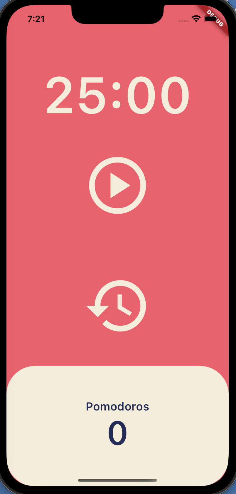
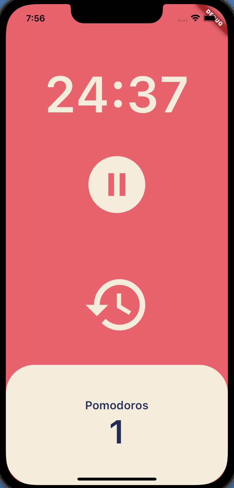

# POMODORO

This is a timer app made with flutter.
Press the Start button to start the 30-minute timer, and for every 30-minute passing, the Pomodors at the bottom go up by 1. You can reset the Pomodors with the watch icon.

## Getting Started

This project is a starting point for a Flutter application.

A few resources to get you started if this is your first Flutter project:

- [Lab: Write your first Flutter app](https://docs.flutter.dev/get-started/codelab)
- [Cookbook: Useful Flutter samples](https://docs.flutter.dev/cookbook)

For help getting started with Flutter development, view the
[online documentation](https://docs.flutter.dev/), which offers tutorials,
samples, guidance on mobile development, and a full API reference.
